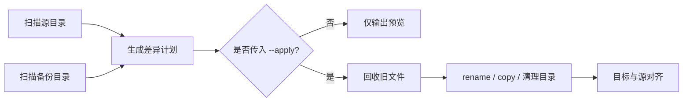

<div align="center">

# FileBackUpSync

**安全、可预览、理解文件移动的增量目录备份工具**

将源目录单向镜像到目标目录，只处理真正发生变化的内容。


[快速开始](#快速开始) · [配置说明](#配置说明) · [安全设计](#安全设计) · [路线图](#路线图)

</div>

---

## 为什么做这个工具

直接完整复制一个大目录既慢又难以确认结果。FileBackUpSync 会比较源目录和备份目录，生成一份明确的同步计划，仅复制新增或修改的文件，并尽量把同内容文件的改名、移动转化为备份盘内的 rename。

它不是双向同步工具：**源目录是唯一事实来源，目标目录是它的备份镜像。**

## 功能亮点

| 能力 | 行为 |
| --- | --- |
| 🔍 先预览再执行 | 默认只输出计划，显式传入 `--apply` 才修改目标目录 |
| 🚚 智能识别 rename | 使用文件大小和 SHA-256 配对同内容文件，避免重新复制 |
| ♻️ 安全回收 | 被替换和删除的旧文件先移入带时间戳的独立回收目录 |
| 📁 完整目录对齐 | 创建源目录中的空目录，并自底向上清理目标残留空目录 |
| 🧹 灵活忽略 | 使用 glob 排除缓存、临时文件和不需要备份的目录 |
| 🧩 小文件预检 | 扫描时定位小文件热点，帮助发现低价值、高开销目录 |
| ⚙️ 无路径硬编码 | 源、目标、回收目录和扫描策略统一由 TOML 配置 |
| 🛡️ 边界保护 | 拒绝互相嵌套的源/目标路径，跳过符号链接，保留异常非空目录 |

## 工作方式



当前计划能够区分：

```text
copy      源目录新增文件
update    同路径文件内容已变化
rename    内容相同但路径发生变化
remove    目标目录中的旧文件
mkdir     源目录中的新增/空目录
rmdir     目标目录中的残留目录
unchanged 内容完全一致，无需操作
```

## 快速开始

### 环境要求

- Python 3.11 或更高版本
- Windows、macOS 或 Linux

### 1. 准备配置

```bash
cp backup.example.toml backup.toml
```

编辑 `backup.toml`，至少设置源目录和目标目录：

```toml
[paths]
source = "/path/to/source"
target = "/path/to/backup"
```

### 2. 预览同步计划

```bash
python3 main.py
```

示例输出：

```text
扫描: 源 1280 个文件，目标 1276 个文件
计划: copy=2, update=1, rename=1, remove=2, mkdir=1, rmdir=1, unchanged=1274
  update  documents/report.pdf
  rename  photos/old-name.jpg -> photos/new-name.jpg

当前为预览模式；确认后使用 --apply 执行。
```

### 3. 确认后执行

```bash
python3 main.py --apply
```

也可以安装为本地命令：

```bash
python3 -m pip install -e .
backup-sync --config backup.toml
backup-sync --config backup.toml --apply
```

## 配置说明

完整模板位于 [`backup.example.toml`](backup.example.toml)：

```toml
[paths]
source = "/path/to/source"
target = "/path/to/backup"
# 不设置时，使用目标目录旁边的 .backup-sync-trash/<目标目录名>
# recycle = "/path/to/recycle-bin"

[ignore]
patterns = [
  ".DS_Store",
  "__pycache__",
  "*.tmp",
  "node_modules",
]

[scan]
detect_renames = true
small_file_size = 65536
small_file_count = 1000
```

### 忽略规则

规则使用 glob，匹配相对于源目录的路径：

| 规则 | 示例效果 |
| --- | --- |
| `*.tmp` | 忽略任意层级的 `.tmp` 文件 |
| `node_modules` | 忽略任意层级的同名目录 |
| `cache/**` | 忽略 `cache` 下的内容 |
| `.DS_Store` | 忽略任意层级的 `.DS_Store` |

> [!IMPORTANT]
> 忽略规则只作用于源目录。为了保持镜像语义，目标目录中与被忽略路径对应的旧文件仍可能进入移除计划。请始终先检查预览。

### 命令行参数

```text
--config PATH   指定配置文件，默认 backup.toml
--apply         执行同步计划；不传时只预览
--no-renames    本次运行禁用 rename 检测
--verbose       输出更详细的日志
```

## 小文件热点检测

大量小文件通常会显著增加扫描和复制耗时。若同一目录中小于等于 `small_file_size` 的文件数量达到 `small_file_count`，预览会给出候选目录：

```text
小文件热点（可考虑加入 ignore.patterns）：
  project/cache: 4268 个 <= 64.0 KiB
```

工具只提供提示，不会自动忽略文件；是否排除由你决定。

## 安全设计

- **默认不写入：** 不带 `--apply` 时永远只预览。
- **旧内容可找回：** 修改和删除的文件保存在 `recycle/YYYY-MM-DD_HHMMSS/`。
- **内容一致才 rename：** 候选文件先按大小筛选，再用 SHA-256 确认。
- **路径隔离：** 源、目标不能相同或互相包含；回收目录不能位于二者内部。
- **保守处理异常目录：** 计划清理的目录若仍非空，会记录警告并保留。
- **不跟随符号链接：** 防止扫描越出配置的目录边界。

> [!CAUTION]
> 这是单向镜像备份。使用 `--apply` 后，目标目录中源目录不存在的文件会被移入回收目录。第一次运行和修改 ignore 规则后务必检查预览。

## 开发与测试

运行测试：

```bash
python3 -m unittest discover -v
```

当前回归测试覆盖：

- 文件新增、修改与旧版本回收
- 内容相同文件的 rename
- 残留目录递归清理
- 空目录同步
- 文件/目录类型互换
- ignore 与小文件热点统计

项目入口：

```text
main.py                 兼容运行入口
backup_sync/cli.py      命令行和计划展示
backup_sync/config.py   TOML 配置读取与路径校验
backup_sync/core.py     扫描、规划和执行核心
tests/                  回归测试
```

## 路线图

- [x] 默认预览与显式执行
- [x] 内容级 rename 检测
- [x] 回收站与目录对齐
- [x] 小文件热点预检
- [ ] 原子复制与复制后校验
- [ ] 失败重试、运行摘要和结构化日志
- [ ] checkpoint 与中断恢复
- [ ] ruff、mypy、覆盖率和 CI
- [ ] wheel / sdist 发布

## 当前状态

项目正在进行工程化改造。现阶段适合在检查预览后用于个人备份；原子写入、断点恢复和稳定版发布仍在路线图中。

---

<div align="center">

如果这个工具解决了你的备份问题，欢迎提交 Issue 或参与改进。

</div>
