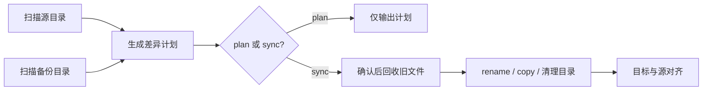

<div align="center">

# FileBackUpSync

**安全、可预览、理解文件移动的增量目录备份工具**

将源目录单向镜像到目标目录，只处理真正发生变化的内容。


[](https://pypi.org/project/file-backup-sync/)
[](https://github.com/qingfusheng/FileBackUpSync/actions/workflows/ci.yml)


[快速开始](#快速开始) · [配置说明](#配置说明) · [安全设计](#安全设计) · [PyPI](https://pypi.org/project/file-backup-sync/) · [GitHub Repo](https://github.com/qingfusheng/FileBackUpSync) · [更新记录](CHANGELOG.md)

项目地址：<https://github.com/qingfusheng/FileBackUpSync>

</div>

---

## 为什么做这个工具

直接完整复制一个大目录既慢又难以确认结果。FileBackUpSync 会比较源目录和备份目录，生成一份明确的同步计划，仅复制新增或修改的文件，并尽量把同内容文件的改名、移动转化为备份盘内的 rename。

它不是双向同步工具：**源目录是唯一事实来源，目标目录是它的备份镜像。**

## 功能亮点

| 能力 | 行为 |
| --- | --- |
| 🔍 先计划再同步 | `plan` 不修改备份内容；`sync` 展示计划并确认后执行 |
| 🚚 智能识别 rename | size → BLAKE3 采样 → 完整 BLAKE3 分层确认，避免重新复制 |
| ♻️ 安全回收 | 被替换和删除的旧文件先移入带时间戳的独立回收目录 |
| 📁 完整目录对齐 | 创建源目录中的空目录，并自底向上清理目标残留空目录 |
| 🧹 灵活忽略 | 使用 glob 排除缓存、临时文件和不需要备份的目录 |
| 🧩 小文件预检 | 扫描时定位小文件热点，帮助发现低价值、高开销目录 |
| ✅ 原子复制与校验 | 临时文件校验成功后才原子替换，失败时不破坏已有备份 |
| 🔁 重试与恢复 | 单文件指数退避重试，checkpoint 支持中断后重新规划并继续 |
| 📊 运行报告 | 每次执行生成 `run_id` 和可机器读取的 JSON 摘要 |
| 📈 全流程进度 | 扫描、内容比较、rename 指纹计算和执行阶段均显示实时进度 |
| 🧰 可扩展分析器 | `analyze small-files/health` 提供统一只读诊断能力 |
| ⚙️ 安全配置管理 | `config get/set/validate` 原子更新配置并校验路径与权限 |
| ⚙️ 无路径硬编码 | 源、目标、回收目录和扫描策略统一由 TOML 配置 |
| 🛡️ 边界保护 | 拒绝互相嵌套的源/目标路径，跳过符号链接，保留异常非空目录 |

## 工作方式



当前计划能够区分：

```text
copy      源目录新增文件
update    同路径文件内容已变化
rename    内容相同但路径发生变化
remove    目标目录中的旧文件
mkdir     源目录中的新增/空目录
rmdir     目标目录中的残留目录
unchanged 内容完全一致，无需操作
```

## 快速开始

### 环境要求

- Python 3.11 或更高版本
- Windows、macOS 或 Linux

### 1. 准备配置

```bash
cp backup.example.toml backup.toml
```

编辑 `backup.toml`，至少设置源目录和目标目录：

```toml
[paths]
source = "/path/to/source"
target = "/path/to/backup"
```

### 2. 预览同步计划

```bash
python3 main.py plan
```

示例输出：

```text
扫描: 源 1280 个文件，目标 1276 个文件
计划: copy=2, update=1, rename=1, remove=2, mkdir=1, rmdir=1, unchanged=1274
  update  documents/report.pdf
  rename  photos/old-name.jpg -> photos/new-name.jpg

```

### 3. 确认后执行

```bash
python3 main.py sync
# 自动任务中显式跳过确认
python3 main.py sync --yes
```

也可以安装为本地命令：

```bash
python3 -m pip install -e .
backup-sync plan --config backup.toml
backup-sync sync --config backup.toml
```

运行依赖（`blake3`、`tomlkit`、`tqdm`）统一声明在 `pyproject.toml`，安装项目时会自动解析，不需要单独维护 `requirements.txt`。

需要在 Python 中组合扫描、规划和执行能力时，使用稳定公共入口：

```python
from backup_sync.sync import build_plan, execute, scan
```

内部的 `storage` 和 `runs` 包分别负责底层文件系统能力与运行记录持久化；业务代码不应再导入已删除的 `backup_sync.core`。

## 配置说明

完整模板位于 [`backup.example.toml`](backup.example.toml)：

```toml
[paths]
source = "/path/to/source"
target = "/path/to/backup"
# 不设置时，使用目标目录旁边的 .backup-sync-trash/<目标目录名>
# recycle = "/path/to/recycle-bin"

[ignore]
patterns = [
  ".DS_Store",
  "__pycache__",
  "*.tmp",
  "node_modules",
]

[scan]
detect_renames = true
compare = "smart"      # smart | hash
small_file_size = 65536
small_file_count = 1000

[sync]
verify = "hash"       # size | hash
retry_max = 3
retry_delay = 0.5

[runtime]
reports = ".backup-sync/reports"
state = ".backup-sync/state"
fingerprint_cache = ".backup-sync/fingerprints.sqlite3"
```

### 忽略规则

规则使用 glob，匹配相对于源目录的路径：

| 规则 | 示例效果 |
| --- | --- |
| `*.tmp` | 忽略任意层级的 `.tmp` 文件 |
| `node_modules` | 忽略任意层级的同名目录 |
| `cache/**` | 忽略 `cache` 下的内容 |
| `.DS_Store` | 忽略任意层级的 `.DS_Store` |

> [!IMPORTANT]
> 忽略规则只作用于源目录。为了保持镜像语义，目标目录中与被忽略路径对应的旧文件仍可能进入移除计划。请始终先检查预览。

### 命令结构

```text
plan                         生成只读同步计划
sync [--yes]                 确认后执行；--yes 跳过确认
resume RUN_ID [--yes]        恢复失败或中断任务
runs list|failed             列出任务
runs show RUN_ID             查看任务和失败详情
analyze small-files          分析小文件热点
analyze health               检查路径、权限和空间
analyze large-files          找出大文件和空间占用热点
analyze duplicates           按内容 hash 查找重复文件
analyze ignored              检查 ignore 规则命中的文件和目录
analyze integrity            按同路径文件 hash 校验源目录和目标目录一致性
config path|list             查看配置位置或全部配置
config get KEY               读取配置项
config set KEY VALUE         验证并原子修改配置项
config validate              校验配置和文件系统
```

各子命令接受 `--config PATH`、`--progress auto|always|never` 和 `--verbose`。`plan`、`sync` 还支持 `--compare smart|hash` 与 `--no-renames`。

配置示例：

```bash
backup-sync config get paths.source
backup-sync config set paths.source "/Volumes/Data/Documents"
backup-sync config validate
```

`config set` 会保留 TOML 注释和格式，先写临时文件并完成完整校验，成功后才原子替换原配置。

### 校验与失败重试

`sync.verify` 控制复制后的校验方式：

- `hash`：默认值，对源文件和临时副本执行完整 BLAKE3 校验，可靠性优先。
- `size`：仅校验字节数，适合更看重速度且介质可靠的场景。

每个失败动作最多重试 `retry_max` 次，等待时间从 `retry_delay` 开始指数增长。单个文件最终失败不会阻断其他动作；运行返回部分失败状态并写入报告。

### 扫描与比较性能

`scan.compare` 控制已有同路径文件的比较策略：

- `smart`：默认值。大小和纳秒级修改时间一致时直接跳过；元数据变化时使用缓存或计算完整 BLAKE3。这是日常增量备份推荐模式。
- `hash`：忽略持久化命中并完整读取两边文件计算 BLAKE3，适合定期审计或怀疑文件时间戳不可信的场景。

临时执行一次完整审计：

```bash
python3 main.py plan --compare hash
```

目录遍历使用 `os.scandir()` 复用文件系统返回的元数据，减少外置盘和 NTFS 驱动上的额外查询。外置机械盘通常受随机读取和 USB 延迟限制，因此扫描时 CPU 不会跑满。

### 分层指纹与持久化缓存

rename 候选先按大小分组。小于等于 192 KiB 的文件使用覆盖完整内容的 quick BLAKE3；更大的文件只读取开头、中间和结尾各 64 KiB。只有 quick 指纹相同的大文件才会继续计算完整 BLAKE3，因此大多数非重复文件无需完整读取。

指纹缓存在 `.backup-sync/fingerprints.sqlite3`，根据根目录、文件标识、大小、`mtime_ns` 和 `ctime_ns` 自动失效。一次运行中也会使用内存缓存，避免规划阶段重复读取。缓存损坏或不可写时程序会警告并自动退回内存计算，不影响备份正确性。

`plan` 不修改源目录、目标目录、checkpoint 或报告，但会更新本地性能缓存。计划摘要会显示缓存命中、quick/strong 计算次数和实际读取量。

### 中断恢复

执行时会在 `.backup-sync/state/<run_id>.json` 逐动作保存 checkpoint。恢复时仍然要求显式确认：

```bash
python3 main.py runs failed
python3 main.py runs show 20260706-204414-c28d631d
python3 main.py resume 20260706-204414-c28d631d
```

恢复操作会重新扫描源目录和当前目标目录，再生成剩余计划。这能避免中断期间源文件变化后继续执行过期计划。对应报告保存在 `.backup-sync/reports/<run_id>.json`。

退出码：

| 退出码 | 含义 |
| --- | --- |
| `0` | 成功，或预览完成 |
| `1` | 部分动作最终失败，可使用 run_id 恢复 |
| `2` | 配置或命令参数错误 |
| `3` | 文件系统、checkpoint 或报告 I/O 错误 |

## 小文件热点检测

大量小文件通常会显著增加扫描和复制耗时。使用专用只读分析器：

```bash
python3 main.py analyze small-files
python3 main.py analyze small-files --size 65536 --count 1000 --json
python3 main.py analyze large-files --min-size 104857600
python3 main.py analyze large-files --scope target --limit 50
python3 main.py analyze ignored --json
python3 main.py analyze duplicates --scope source --estimate-only
python3 main.py analyze duplicates --scope target --yes --json
python3 main.py analyze duplicates --path /Volumes/Archive --yes
python3 main.py analyze integrity --estimate-only
python3 main.py analyze integrity --yes --json
```

`duplicates` 和 `integrity` 会读取文件内容计算 hash。建议先使用 `--estimate-only`
查看预计读取量，确认后再添加 `--yes` 执行完整检测。
`duplicates` 默认分析源目录，可通过 `--scope source|target` 切换范围，
也可重复传入 `--path DIR` 额外指定目录。

后续可扩展的分析器方向：

| 分析器 | 类型 | 用途 |
| --- | --- | --- |
| `stale-files` | 轻量扫描 | 按 mtime 找长期未变化的归档候选 |
| `empty-dirs` | 轻量扫描 | 找出源目录空目录和同步后可能残留目录 |
| `name-conflicts` | 轻量扫描 | 检查大小写不敏感文件系统上的潜在冲突 |
| `symlinks` | 轻量扫描 | 列出被扫描器跳过的符号链接 |
| `permissions` | 轻量扫描 | 检查不可读文件、不可进入目录和特殊文件 |
| `drift` | 中等 I/O | 比较源/目标文件数量、大小和 mtime 漂移 |
| `recycle` | 轻量扫描 | 检查回收目录体积、旧 run 残留和清理建议 |
| `cache` | 轻量扫描 | 检查指纹缓存位置、大小和可用性 |
| `hash-sample` | 重 I/O | 抽样 hash 校验目标文件内容 |

若同一目录中小于等于阈值的文件数量达到设定值，会给出候选目录：

```text
小文件热点（可考虑加入 ignore.patterns）：
  project/cache: 4268 个 <= 64.0 KiB
```

工具只提供提示，不会自动忽略文件；是否排除由你决定。

## 进度显示

在交互式终端或 PyCharm Run Console 中运行时，工具会分别显示源扫描、目标扫描、内容比较、rename 指纹计算和执行进度。扫描阶段会显示已经发现的文件数与速度；已知任务总量的阶段会显示百分比、预计剩余时间和当前路径。

如果 IDE 没有被自动识别，可以强制开启：

```bash
python3 main.py plan --progress always
```

输出重定向到文件或在 CI 中运行时，动态进度条会自动关闭，JSON 报告和普通日志不受影响。

## 安全设计

- **计划不改备份内容：** `plan` 不创建目标目录、checkpoint 或报告，仅更新本地指纹性能缓存。
- **执行需要确认：** `sync` 和 `resume` 默认要求输入完整的 `yes`；非交互环境必须显式使用 `--yes`。
- **旧内容可找回：** 修改和删除的文件保存在带唯一 `run_id` 的回收目录中。
- **原子替换：** 新内容先复制到目标同目录临时文件，通过校验后才替换正式文件。
- **更新失败不破坏旧备份：** 更新时先保留旧版本副本，原子替换失败仍维持原目标文件。
- **内容一致才 rename：** 候选文件经过 size、quick BLAKE3 和必要时的完整 BLAKE3 分层确认。
- **路径隔离：** 源、目标不能相同或互相包含；回收目录不能位于二者内部。
- **保守处理异常目录：** 计划清理的目录若仍非空，会记录警告并保留。
- **不跟随符号链接：** 防止扫描越出配置的目录边界。

> [!CAUTION]
> 这是单向镜像备份。执行 `sync` 后，目标目录中源目录不存在的文件会被移入回收目录。第一次运行和修改 ignore 规则后务必先执行 `plan`。

## 开发与测试

运行测试：

```bash
python3 -m unittest discover -v
```

运行全部质量门禁：

```bash
python3 -m pip install -e ".[dev]"
ruff check .
ruff format --check .
mypy
coverage run -m unittest discover -v
coverage report
python3 -m build
```

GitHub Actions 会在 Python 3.11、3.12 和 3.13 上运行测试，并要求核心代码覆盖率不低于 80%。

当前回归测试覆盖：

- 文件新增、修改与旧版本回收
- 内容相同文件的 rename
- 残留目录递归清理
- 空目录同步
- 文件/目录类型互换
- ignore 与小文件热点统计
- 原子替换失败保护与复制重试
- JSON 报告、checkpoint 和恢复流程
- 扫描、计划和执行进度回调
- 子命令确认策略、任务发现和失败详情
- Analyzer 抽象接口与 registry
- 配置读取、原子修改及文件系统校验
- macOS immutable (`uchg`) 文件的替换、移动与删除

项目入口：

```text
main.py                 PyCharm/源码运行入口
pyproject.toml          打包、依赖与质量工具配置
backup.example.toml     可复制的完整配置模板
CHANGELOG.md            版本更新记录
MANIFEST.in             源码发布包附加文件清单
backup_sync/cli.py      命令行和计划展示
backup_sync/config.py   TOML 配置读取与路径校验
backup_sync/config_manager.py  配置查询、原子修改与验证
backup_sync/formatting.py  通用显示格式化
backup_sync/progress.py    终端进度显示
backup_sync/sync/          扫描、计划、动作执行与领域模型
backup_sync/storage/       指纹、归档、原子文件操作与平台保护属性
backup_sync/runs/          checkpoint 与 JSON 运行报告
backup_sync/analyzers/     可扩展只读分析器
tests/sync/                同步领域回归测试
tests/storage/             文件系统与指纹测试
tests/runs/                运行报告测试
tests/                     CLI、配置和分析器测试
```

## 路线图

- ✅ 默认预览与显式执行
- ✅ 内容级 rename 检测
- ✅ 回收站与目录对齐
- ✅ 小文件热点预检
- ✅ 原子复制与复制后校验
- ✅ 失败重试、run_id 和 JSON 摘要
- ✅ checkpoint 与中断恢复
- ✅ ruff、mypy、覆盖率和 CI
- ✅ plan/sync/resume/runs 子命令
- ✅ 可扩展 analyze 框架
- ✅ 原子配置管理命令
- ✅ wheel / sdist 构建验证
- ⏳ 独立 JSON 日志
- ✅ ignored 分析器
- ✅ duplicates/integrity 分析器
- ⏳ 自动化版本发布

## 当前状态

项目已具备安全预览、原子复制、内容校验、失败重试和中断恢复等核心可靠性能力。目前继续完善日志查询、跨平台真实介质测试和稳定版发布流程。

---

<div align="center">

如果这个工具解决了你的备份问题，欢迎提交 Issue 或参与改进。

</div>
